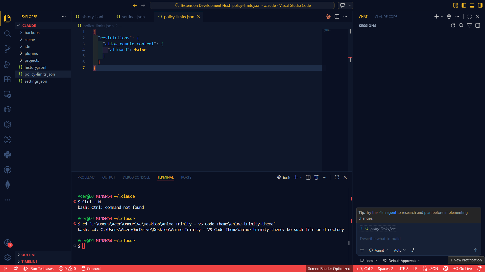
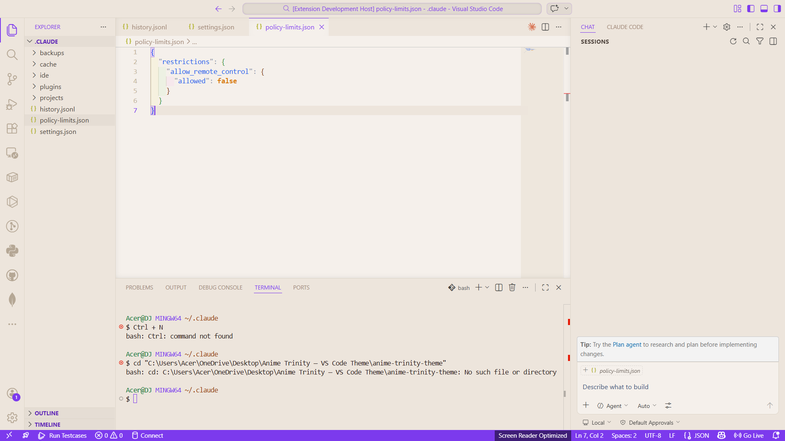
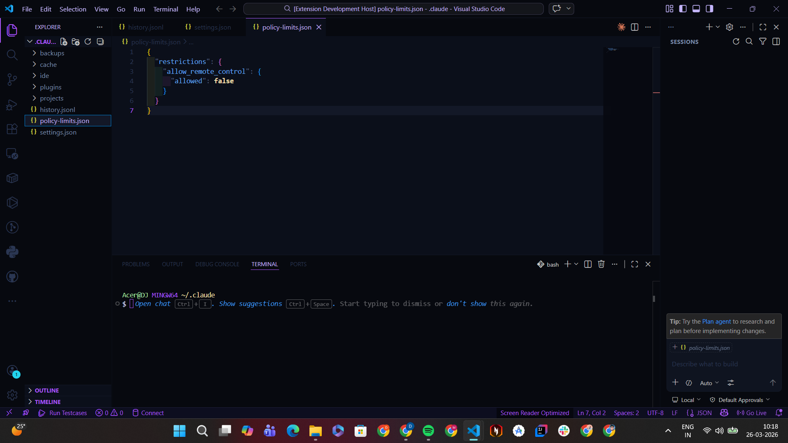

# 🌊 Anime Trinity Theme

> *Three worlds. One extension. Infinite focus.*

A premium VS Code color theme extension featuring three
anime-inspired environments crafted for developer comfort,
readability, and aesthetic delight.

---

## 🎨 Themes

### 🏴‍☠️ One Piece Dark
Built for the bold. Deep navy battlefield with fiery red
keywords and golden highlights — perfect for late-night
backend battles.

**Palette:**
| Token | Color |
|---|---|
| Background | `#0f172a` Deep Navy |
| Keywords | `#ef4444` Pirate Red |
| Strings | `#22c55e` Ocean Green |
| Functions | `#38bdf8` Sky Blue |
| Constants | `#fbbf24` Gold |

---

### 📚 Robin Cozy
For thinkers and architects. A warm beige canvas with
lavender and sage — comfortable for marathon sessions,
beautiful on every monitor.

**Palette:**
| Token | Color |
|---|---|
| Background | `#f5f0eb` Warm Beige |
| Keywords | `#7c3aed` Violet |
| Strings | `#16a34a` Forest Green |
| Functions | `#2563eb` Ink Blue |
| Constants | `#d97706` Amber |

---

### 💜 Purple Blue
The midnight canvas of a hacker's den. Neon purples,
electric cyans, and deep starfield backgrounds — every
file feels like a cyberpunk anime scene.

**Palette:**
| Token | Color |
|---|---|
| Background | `#0b0f1a` Void Black |
| Keywords | `#a855f7` Neon Purple |
| Strings | `#22d3ee` Electric Cyan |
| Functions | `#60a5fa` Ice Blue |
| Constants | `#f9e2af` Warm Gold |

---

## 🚀 Installation

### Via Marketplace (Recommended)
1. Open VS Code
2. Press `Ctrl+Shift+X`
3. Search **"Anime Trinity Theme"**
4. Click **Install**

### Via Command Line
```bash
code --install-extension your-publisher.anime-trinity-theme
```

---

## 🎯 Activate a Theme
```
Ctrl+K → Ctrl+T → Search theme name → Enter
```

Or:
```
Ctrl+Shift+P → Preferences: Color Theme
```

---

## ✨ Features

- ✅ 3 unique themes — dark, light, and cyberpunk
- ✅ Full UI theming — sidebar, tabs, terminal, status bar
- ✅ Optimized for JS, TS, Python, Java, HTML, CSS, JSON
- ✅ Italic comments for improved scanability
- ✅ No pure black or white — zero eye strain
- ✅ Git decoration colors per theme
- ✅ Terminal ANSI palette included

---

## 🛠 Tested Languages

| Language | Status |
|---|---|
| JavaScript / TypeScript | ✅ |
| Python | ✅ |
| Java | ✅ |
| HTML / CSS | ✅ |
| JSON | ✅ |
| Markdown | ✅ |

---

## 📸 Screenshots

### One Piece Dark


### Robin Cozy


### Purple Blue


---

## 🗺 Roadmap

- [ ] Naruto Sage Mode theme
- [ ] Attack on Titan theme
- [ ] File icon theme pack
- [ ] Community theme voting

---

## 👨‍💻 Author

**Dhruva Jhanjhari** — Developer & UI/UX Designer
[GitHub](https://github.com/your-username)

---

## 📄 License
MIT — free to use, share, and build upon.

---

*Built with ❤️ and too much anime.*
